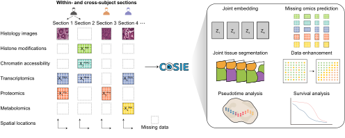

Welcome to the COSIE documentation!
==================================

COSIE enables within- and **C**\ r\ **O**\ ss-subject **S**\ patial multimodal **I**\ ntegration, prediction, and **E**\ nhancement.

To get started with ``cosie``, check out the `installation guide <install.rst>`__ and `tutorials <tutorials.rst>`__.

.. raw:: html
   

          

.. toctree::
   :maxdepth: 2
   :caption: Contents:

   install
   tutorials
   api
   references

Citation
========

If you use this tool in your research, please cite our work.
